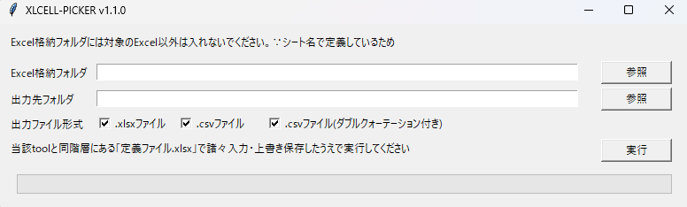

# XLCELL-PIKER_v1.1.0

## 作成背景
決まったフォーマットのExcelファイルが複数存在していることがあると思います。

* 例1）発注書や見積書が、顧客ごとにExcelファイルで存在
* 例2）ある工程に対してExcelのチェックリストがロットごとに存在

特定の費用項目、または、チェック項目や記録を一覧で取得したいなと考え作りました。

## 概要（使用シーン）
* **同じフォーマット**の複数のExcelファイルに対して、特定のセルから値を一括抽出・一覧化したいときを想定して作成しています。
* 一覧の形は以下の形となります。user定義カラム名1~nがuserで定義する列です。

|(index)|ファイル名|SHA1ハッシュ値|user定義カラム名1|user定義カラム名n|
|:---|:---|:---|:---|:---|
|1|Excelファイル1|4b890444dca5a14d76c1908ab6a143a65dc71be0|●●●●|■■■■|
|n|Excelファイルn|db459148c65fb09315ba279090c445bf20218aa7|○○○○|□□□□|

* 一覧化では、読み込んだファイル名とそのファイルのハッシュ値（SHA1）の列をデフォルトで出力します。
* 出力ファイルは、```.xlsx```,```.csv```,```.csv(ダブルコーテーション付き)```でチェックボックスにより選択します。

## 使用前の準備
* 「.exeファイル」と「定義ファイル.xlsx」をローカルにダウンロード(「<>code」>「Download ZIP」からまるごとDLでok)
* ローカル上の任意の場所に上記2点を同階層で格納
* 「定義ファイル.xlsx」を開き黄色セルに必要情報入力・上書き保存
* └読み込むシート名、出力するファイルのファイル名、カラム名、セル番地を定義

## つかいかた
* .exeファイルをWクリックして起動。（ポップアップが生じた場合は必要に応じて実行を認める）
* input：以下の階層で親フォルダを読込先ディレクトリとして指定する
```
親フォルダ
    ├── Excelファイル1.xlsx
    ├── Excelファイル2.xlsx
    └── Excelファイル3.xlsx
```
* output：任意のディレクトリ
* outputはPythonでデータフレームから調整なしでExcelに書き出していますので、罫線や列幅調整は出力後user側で必要に応じて実施ください。
* 定義ファイルで指定したシートがないExcelがある場合、当該Excelファイル名をoutputディレクトリに.csvファイルで一覧を出力します。

## 動作環境
### 実行画面のイメージ
<br>
### 各モジュールのバージョン情報
* Python 3.10.9
* そのほかのモジュールは以下の通り(requirements.txtで定義)
```
altgraph==0.17.3
ansicon==1.89.0
appdirs==1.4.4
blessed==1.20.0
certifi==2023.7.22
charset-normalizer==3.2.0
et-xmlfile==1.1.0
flyingcircus==0.1.4.1
idna==3.4
jinxed==1.2.0
numpy==1.25.1
openpyxl==3.1.2
packaging==23.1
pandas==2.0.3
pefile==2023.2.7
pip==23.3.1
pyinstaller==5.13.0
pyinstaller-hooks-contrib==2023.5
python-dateutil==2.8.2
pytk==0.0.2.1
pytz==2023.3
pywin32==306
pywin32-ctypes==0.2.2
requests==2.31.0
setuptools==65.5.0
setuptools-scm==7.1.0
six==1.16.0
tomli==2.0.1
typing_extensions==4.7.1
tzdata==2023.3
urllib3==2.0.4
wcwidth==0.2.6
```
 
### 以上
